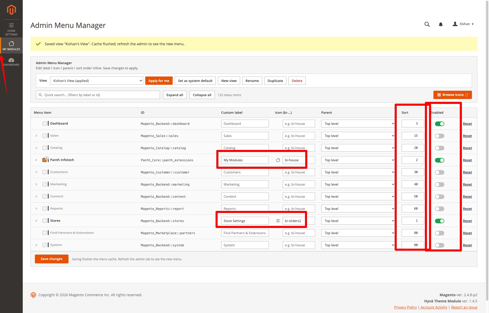
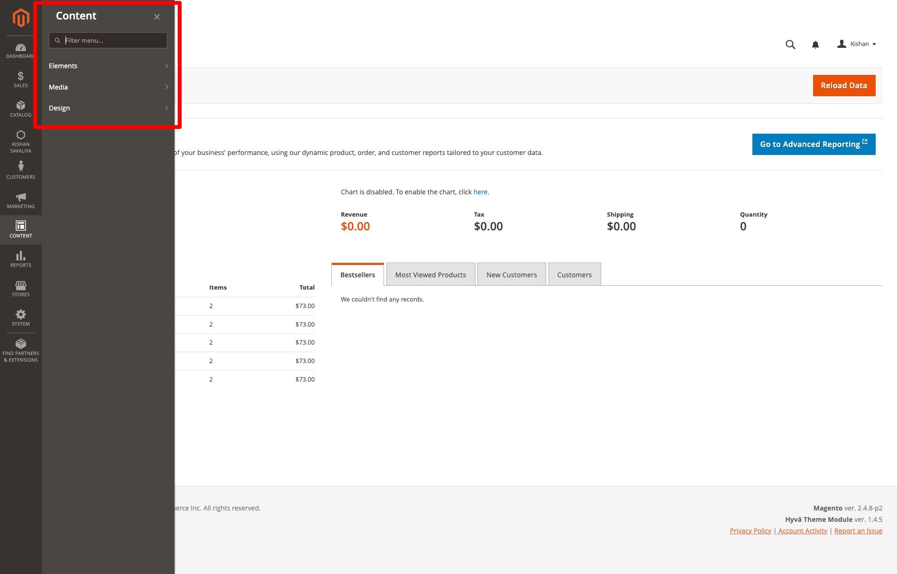

# Magento 2 Admin Menu Manager

Admin Menu Manager customises the Magento 2 backend navigation. From a single admin grid you can hide, rename, re-icon, recolor, reorder and reparent any backend menu item. The overrides are stored in named "views"; one view is the system default and each admin user can apply a different view to their own account.

The module also ships an optional "drill-down" rendering style for top-level (L0) menu panels: a back button, an in-panel search box and click-to-open navigation for the menus you select. It only affects the adminhtml area; it ships no storefront files and does not change storefront navigation. It is used by store administrators who want a smaller or differently organised backend menu for their team.

Product page: [kishansavaliya.com/magento-2-admin-menu-manager.html](https://kishansavaliya.com/magento-2-admin-menu-manager.html)



## Features

- Manager grid ("Admin Menu Manager" page) listing every backend menu item the current admin user is allowed to see, with the item title, its menu ID, and inline fields for a custom label, an icon, a parent, a sort order, a colour accent and an enabled switch.
- Hide any menu item by switching it off; hidden items are removed from the rendered menu by a plugin on `Magento\Backend\Model\Menu\Config`.
- Rename any item with a custom label; an empty label falls back to the stock title.
- Icons: a Bootstrap Icons class name such as `bi-house` renders as a Bootstrap icon; any other short text (for example an emoji) renders as a text glyph in front of the label. When a custom icon is set, the stock Magento icon for that item is suppressed.
- Colour accent: a hex colour renders as a 4 px stripe on the left edge of the menu item.
- Reparent: move an item under any other menu item or to the top level. A moved item is placed in its new level by its sort order override, or by its stock sort order when it has none.
- Reorder: give an item a numeric sort order; the affected menu level is re-sorted by effective sort order, so an override is compared with the stock sort orders of the items around it (for example Dashboard set to 95 is placed after System at 80). When an override equals a stock sort order, the overridden item comes first.
- Named views: create, rename, duplicate and delete views. The "Default" view is seeded on install and cannot be deleted; if its row is ever removed from the database, opening the manager or saving recreates an empty Default view (active only when no other view is active). "Apply for me" stores a per-user preference; "Set as system default" makes a view the fallback for every admin user without a personal preference.
- Per-row "Reset" removes the override for that item in the current view.
- Self-protection: `Panth_AdminMenuManager::menu_manager`, `Magento_Backend::stores`, `Magento_Backend::stores_settings` and the Configuration entry (`Magento_Config::system_config`) cannot be hidden or moved, so the manager page and Stores > Configuration always stay reachable. Their rows show "Locked" with the reason, their parent picker is disabled, and a save request that tries to switch them off or move them is refused with an error message.
- Drill-down panels (optional, on by default for the `Panth_Core::panth_extensions` menu): the selected L0 panels get a back button and a search box; clicking a parent entry drills into its children, the search filters entries by label and shows a breadcrumb for each match, and the Escape key closes the panel. All `Panth_*` L0 menus always use drill-down.
- "Open in a new tab": menu IDs listed in configuration get `target="_blank"`, `rel="noopener"` and a small external-link icon inside drill-down panels.
- Per-user menu: Magento caches one shared menu object (`backend_menu_object`) for all admin users. The module applies the current user's view to that menu after it is loaded, so the shared cache entry always holds the stock menu and one admin's view never reaches another admin.
- Cache handling: the rendered admin menu block is cached per admin user and per active view, and is tagged with `PANTH_ADMIN_MENU_VIEW_<view_id>`. Saving or resetting overrides, or deleting a view, cleans only that tag, so only the admins who use that view get a rebuilt menu. Switching views needs no cache clean. No cache type is flushed.
- Grid helpers: quick search by label or ID (lists only matching rows, whatever the collapse state), expand/collapse of the tree (remembered per view in the browser), a live icon preview and a link to the Bootstrap Icons library. Below 1280px wide the ID column is folded under each item title so the editable columns stay readable.

## Compatibility

| Platform | Versions |
|---|---|
| Magento Open Source | 2.4.4, 2.4.5, 2.4.6, 2.4.7, 2.4.8 |
| Adobe Commerce | 2.4.4, 2.4.5, 2.4.6, 2.4.7, 2.4.8 |
| PHP | 8.1, 8.2, 8.3, 8.4 |

Composer constraints on Magento packages: `magento/framework` ^103.0, `magento/module-backend` ^102.0, `magento/module-config` ^101.2, `magento/module-ui` ^101.2, `magento/module-user` ^101.2.

## Requirements

- Magento Open Source or Adobe Commerce 2.4.4 to 2.4.8
- PHP ~8.1.0, ~8.2.0, ~8.3.0 or ~8.4.0
- `mage2kishan/module-core` ^1.0 (module `Panth_Core`; it provides the parent menu entry and is loaded before this module)
- No other required or suggested packages are declared in `composer.json`.

Bootstrap Icons 1.11.3 (MIT licence) is bundled in `view/adminhtml/web/css/bootstrap-icons/` together with its fonts and licence file. No CDN or other third-party request is made. The stylesheet is added only on the manager page and on admin pages where the current user's active view uses a `bi-*` icon.

## Installation

```bash
composer require mage2kishan/module-admin-menu-manager
bin/magento module:enable Panth_Core Panth_AdminMenuManager
bin/magento setup:upgrade
bin/magento setup:di:compile
bin/magento setup:static-content:deploy -f
bin/magento cache:flush
```

`setup:di:compile` is only needed in production mode. The module ships CSS and JavaScript under `view/adminhtml/web`, so static content must be deployed in production mode.

`setup:upgrade` creates the three database tables and runs the `SeedDefaultView` data patch, which inserts the "Default" view (ID 1) as the active system default.

Check the module status:

```bash
bin/magento module:status Panth_AdminMenuManager
```

## Configuration

Admin path: Stores > Configuration > Panth > Admin Menu Manager. The section is shown at the default scope only (no website or store view values). The section ID is `panth_drilldown`.

Group "General":

| Setting | Default | What it does |
|---|---|---|
| Menu manager | n/a | A button that opens the "Admin Menu Manager" grid page. |
| Enable drill-down | Yes | Master switch for the drill-down rendering style. When set to No, every admin menu uses Magento's default hover behaviour. |
| Apply to top-level menus | `Panth_Core::panth_extensions` | Multiselect of top-level (L0) menu items that use click-to-open drill-down. Unselected menus keep Magento's default hover behaviour. All `Panth_*` L0 menus are always included; they are added back on save even if unselected. Shown only when "Enable drill-down" is Yes. |
| Open in a new tab - Menu IDs | empty | One menu item ID per line. Links inside a drill-down panel whose ID matches open in a new browser tab and get an external-link icon. Shown only when "Enable drill-down" is Yes. |

Config paths:

- `panth_drilldown/general/enabled`
- `panth_drilldown/general/targets`
- `panth_drilldown/general/new_tab_targets`

Default behaviour after install: drill-down is enabled for the `Panth_Core::panth_extensions` menu only, no other menu is changed, and the "Default" view contains no overrides.

Admin pages and menu entries:

- The module adds a group "Admin Menu Manager" under the `Panth_Core::panth_extensions` menu, with two children: "Manager" (opens the grid at `panth_menu_manager/manager/index`) and "Configuration" (opens the configuration section above).
- The grid page title is "Admin Menu Manager".

## Usage

1. Open the "Manager" page (menu entry "Admin Menu Manager" > "Manager", or the "Menu manager" button in configuration).
2. Choose the view to edit in the "View" dropdown. The view marked "(applied)" is the one currently rendered for your account; "(default)" marks the seeded Default view.
3. Edit rows inline:
   - Hide an item: switch off "Enabled". Hidden items are removed from the rendered menu together with their children. Locked rows cannot be switched off.
   - Rename: type a "Custom label". Clear it to return to the stock title.
   - Icon: enter a Bootstrap Icons class (`bi-house`, `bi-gear`) or a short text glyph.
   - Colour: pick a colour with the swatch; the clear button next to it removes the colour. Only `#rgb`, `#rrggbb` and `#rrggbbaa` values are stored.
   - Parent: pick "Use stock parent", "Move to top level" or any other menu item. The picker does not offer the row itself or any of its sub-items (including sub-items moved there in the same edit), and the save is checked again on the server: a parent that would put an item under itself or one of its own sub-items is refused with an error message and the item stays under its stock parent.
   - Sort: enter a number. A value equal to the stock sort order is treated as "no override".
4. Click "Save changes". The overrides are written for the selected view, the cached menu of the admins using that view is cleaned, and the message asks you to reload the page to see the new menu.
5. Use the toolbar to manage views: "Apply for me" (this account only), "Set as system default" (fallback for all admin users without a personal preference), "New view", "Rename", "Duplicate" (copies all overrides of the current view; the name prompt stays open with a message until a name is entered, names are trimmed, stripped of HTML and limited to 128 characters) and "Delete" (removes the view and all its overrides; the Default view is refused).

Scope: overrides belong to a view, not to a website or store. Which view is rendered is resolved per admin user: the user's own preference if one exists, otherwise the globally active view, otherwise view ID 1.

Effect on ACL: the module does not change roles or resources. Hiding an item removes it from the rendered menu only; a user whose role allows the resource can still open the page by URL. The grid itself lists only the items the current user's role allows. Renaming and reordering do not affect permissions.

Reset:

- "Reset" on a row removes that item's override in the current view.
- Saving a row with all fields at their stock values also deletes the stored override.
- Deleting a view removes all its overrides (foreign key cascade).
- To go back to the stock menu for everyone, activate a view without overrides (for example an empty new view) as the system default, or reset each row in the Default view.



## Developer Notes

- Module name: `Panth_AdminMenuManager`; Composer package: `mage2kishan/module-admin-menu-manager`; PHP namespace: `Panth\AdminMenuManager`.
- Module sequence: `Panth_Core`, `Magento_Backend`, `Magento_User`.
- Plugins (`etc/di.xml`):
  - `Plugin\Backend\MenuConfigPlugin::afterGetMenu` on `Magento\Backend\Model\Menu\Config` applies labels, removals, moves and sort order for the current admin user to the menu after it is loaded from the shared cache, once per request. The personalised menu is never written to the cache.
  - `Plugin\Backend\MenuBlockPlugin` on `Magento\Backend\Block\Menu` adds the active view ID to the menu block cache key and the `PANTH_ADMIN_MENU_VIEW_<view_id>` cache tag.
  - `Plugin\Backend\AnchorRendererPlugin::afterRenderAnchor` on `Magento\Backend\Block\AnchorRenderer` injects the custom icon markup.
- Services: `Service\MenuOverrideService` (read, bulk upsert and reset of overrides per view), `Service\MenuCache` (cache tag per view) and `Service\ViewService` (list, create, rename, duplicate, delete, activate views and resolve the active view for a user).
- Blocks: `Block\Adminhtml\Manager\Tree` (grid data), `Block\Adminhtml\Config` (drill-down JSON config for `window.panthDrilldownConfig`), `Block\Adminhtml\CustomIconCss` (inline CSS for icons and colour stripes), `Block\Adminhtml\BootstrapIconsLink` (link to the bundled Bootstrap Icons stylesheet, only when needed), `Block\Adminhtml\System\Config\ManagerLink` (configuration button).
- Controllers (route `panth_menu_manager`): `manager/index` (GET), `manager/save`, `manager/reset`, `view/save`, `view/delete`, `view/activate`, `view/duplicate` (POST). All use the ACL resource `Panth_AdminMenuManager::manage_overrides`.
- ACL resources: `Panth_AdminMenuManager::config` (configuration section, under `Magento_Config::config`) and `Panth_AdminMenuManager::manage_overrides` (manager page and menu entries, under `Magento_Backend::stores_settings`).
- Config source and backend models: `Model\Config\Source\MenuItems` (L0 menu options) and `Model\Config\Backend\Targets` (adds all `Panth_*` L0 IDs on save).
- Data patch: `Setup\Patch\Data\SeedDefaultView`.
- Database tables (`etc/db_schema.xml`):
  - `panth_admin_menu_view`: `view_id`, `label`, `is_active`, `is_default`, `created_at`, `updated_at`.
  - `panth_admin_menu_override`: `override_id`, `view_id`, `menu_item_id`, `is_disabled`, `custom_label`, `custom_icon`, `custom_color`, `custom_parent_menu_item_id`, `sort_order`, `created_at`, `updated_at`; unique on (`view_id`, `menu_item_id`); cascades on view deletion.
  - `panth_admin_menu_user_pref`: `admin_user_id`, `active_view_id`, `updated_at`; cascades on admin user or view deletion.
- Adminhtml assets: `view/adminhtml/web/css/drilldown.css`, `manager.css`, `bootstrap-icons.css`, the bundled `css/bootstrap-icons/` (stylesheet, fonts, licence) and `view/adminhtml/web/js/drilldown.js`. The drill-down script adds behaviour on top of Magento's `globalNavigation` widget and watches the `_show` class; it does not replace the core menu block.
- No observers, console commands, cron jobs, virtual types or preferences are declared.

## Uninstallation

```bash
bin/magento module:disable Panth_AdminMenuManager
composer remove mage2kishan/module-admin-menu-manager
bin/magento setup:upgrade
bin/magento setup:di:compile
bin/magento cache:flush
```

After these steps the tables `panth_admin_menu_view`, `panth_admin_menu_override` and `panth_admin_menu_user_pref` remain in the database, and the values under `panth_drilldown/general/*` remain in `core_config_data`. Remove them manually if you no longer need them. `Panth_Core` stays installed if other Panth modules use it.

## Support

- Product page: [kishansavaliya.com/magento-2-admin-menu-manager.html](https://kishansavaliya.com/magento-2-admin-menu-manager.html)
- Contact form: [kishansavaliya.com/contact](https://kishansavaliya.com/contact)
- Email: kishansavaliyakb@gmail.com
- GitHub issues: [github.com/mage2sk/module-admin-menu-manager/issues](https://github.com/mage2sk/module-admin-menu-manager/issues)

## License

Proprietary, as declared in `composer.json`. The package is published on Packagist and can be installed with Composer; see the product page for the terms of use.

## Changelog

See [CHANGELOG.md](CHANGELOG.md).

## Links

- Website: [kishansavaliya.com](https://kishansavaliya.com)
- All extensions: [kishansavaliya.com/magento-extensions.html](https://kishansavaliya.com/magento-extensions.html)
- GitHub: [github.com/mage2sk/module-admin-menu-manager](https://github.com/mage2sk/module-admin-menu-manager)
- Packagist: [packagist.org/packages/mage2kishan/module-admin-menu-manager](https://packagist.org/packages/mage2kishan/module-admin-menu-manager)
